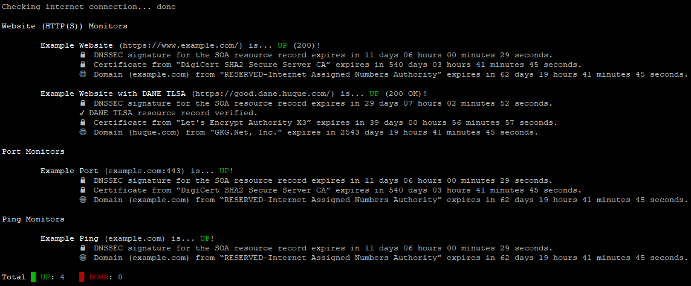

# Remote Servers Status
Linux Remote Servers Status Monitoring Script

Copyright © 2019 Teal Dulcet

[Monitors](https://en.wikipedia.org/wiki/Website_monitoring) the status of one or more remote servers and send notifications when status changes state. Supports Uptime, SSL/TLS Certificate, Domain, [DNS Security Extensions](https://en.wikipedia.org/wiki/Domain_Name_System_Security_Extensions) (DNSSEC),  [DNS-based Authentication of Named Entities](https://en.wikipedia.org/wiki/DNS-based_Authentication_of_Named_Entities) (DANE) TLSA, [Blacklist](https://en.wikipedia.org/wiki/DNSBL) and Visual monitoring for Website (HTTP(S)), Port (POP3, IMAP, SMTP, FTP, SSH/SFTP, etc.) and [Ping](https://en.wikipedia.org/wiki/Ping_(networking_utility)) monitor types. Uses Unicode [symbols](https://en.wikipedia.org/wiki/Miscellaneous_Symbols) and [Emojis](https://unicode.org/emoji/charts/full-emoji-list.html) and [terminal colors and formatting](https://misc.flogisoft.com/bash/tip_colors_and_formatting) to output the results to the console.

Please visit [tealdulcet.com](https://www.tealdulcet.com/) to support this script and my other software development.

## Usage

This script can be run manually to check the state of one or more remote servers.

Requires the curl, netcat, ping, dig, delv, whois and openssl commands, which are included on most Linux distributions.

1. Make sure the required commands above are installed. On the Raspberry Pi, run: `sudo apt-get update` and `sudo apt-get install dnsutils bind9 whois`.
2. Create a directory for the script and CD into that directory. Run: `mkdir status` and `cd status`.
3. Download the script ([status.sh](status.sh)). Run: `wget https://raw.github.com/tdulcet/Remote-Servers-Status/master/status.sh`.
4. Open the script in an editor and set the variables at the top. At a minimum, you need to provide one To e-mail address and one Website, Port or Ping monitor.
5. Execute the script once to make sure there are no errors. Run: `./status.sh`.

The default Log file is `status.log`.

### Run the script automatically

This script can also be run automatically from a cron job to regularly monitor one or more remote servers and send notifications when they change state. It can easily be run from a home network on a [Raspberry Pi](https://www.raspberrypi.org/) or it can be run in the cloud in the respective Free tiers for [Amazon Web Services](https://aws.amazon.com/free/), [Google Cloud Platform](https://cloud.google.com/free/), [Microsoft Azure](https://azure.microsoft.com/en-us/free/) or [Oracle Cloud](https://www.oracle.com/cloud/free/). Make sure the computer is running 24/7 and it is on a different network from the servers being monitored.

1. Complete the steps above.
2. Open the script in an editor again and uncomment the `SEND` variable to enable the sending of notifications (e-mails and text messages). If the computer is on a residential network or if it does not have an SMTP server setup then you will also need to set the SMTP server variables in order to send e-mails.
3. Set the script to run automatically every minute. Replace "* * * * *" with "*/5 * * * *" to run every 5 minutes.
	1. Run: `crontab -e`.
	2. Add this to the bottom of the file (replace "/home/username/status/" with the scripts path): `* * * * * cd /home/username/status/ && ./status.sh > /dev/null`
	3. Or run this to do the above steps: `crontab -l | { cat; echo "* * * * * cd \"$PWD\" && ./status.sh > /dev/null"; } | crontab -`

### Visual monitoring

Optional visual monitoring requires [Firefox Quantum](https://www.mozilla.org/en-US/firefox/) ([57 or greater](https://developer.mozilla.org/en-US/docs/Mozilla/Firefox/Headless_mode#Taking_screenshots)) and ImageMagick.
I recommended you install [Firefox Quantum: Developer Edition](https://www.mozilla.org/en-US/firefox/developer/)/Beta or Nightly to automatically test the websites compatibility with the next release or next two releases of Firefox, respectively.

1. Complete the steps above.
2. Make sure Firefox Quantum and ImageMagick are installed. On x86_64 Linux, click these links to download the latest version: [Firefox](https://download.mozilla.org/?product=firefox-latest&lang=en-US&os=linux64), [Firefox Developer Edition](https://download.mozilla.org/?product=firefox-devedition-latest&lang=en-US&os=linux64), [Firefox Beta](https://download.mozilla.org/?product=firefox-beta-latest&lang=en-US&os=linux64), [Firefox Nightly](https://download.mozilla.org/?product=firefox-nightly-latest&lang=en-US&os=linux64) or [Firefox Nightly AddressSanitizer](https://developer.mozilla.org/en-US/docs/Mozilla/Testing/ASan_Nightly_Project#Requirements) build and [follow these instruction](http://mzl.la/1xKrIV5) to install. On the Raspberry Pi, run: `sudo apt-get install firefox-esr imagemagick`.
3. Open the script in an editor and uncomment the `PERCENTAGE` variable to enable visual monitoring.

By default, the latest screenshot for each website monitor is saved to `screenshot.<URL without backslashes>.png`. For example, if the monitor's URL were https://example.com/, the file would be `screenshot.https:example.com.png`.

## Feature comparison

<table>
  <tr>
    <th rowspan="2"></th>
    <th rowspan="2"></th>
    <th rowspan="2">This Remote Servers Status Script</th>
    <th colspan="2">Uptime Robot</th>
    <th colspan="2">StatusCake</th>
    <th colspan="2">HetrixTools</th>
  </tr>
  <tr>
    <th>Pro Plan</th>
    <th>Free Plan</th>
    <th>Superior</th>
    <th>Free</th>
    <th>Professional</th>
    <th>Free</th>
  </tr>
  <tr>
    <th colspan="2">Monitors</th>
    <td>∞</td>
    <td>50 (or more)</td>
    <td>50</td>
    <td>100</td>
    <td>10</td>
    <td>25</td>
    <td>10</td>
  </tr>
  <tr>
    <th colspan="2">Monitor/Check Interval</th>
    <td>1 min</td>
    <td>1 min</td>
    <td>5 min</td>
    <td>1 min</td>
    <td>5 min</td>
    <td>1 min</td>
    <td>1 min</td>
  </tr>
  <tr>
    <th rowspan="3">Monitor types</th>
    <td>Website (HTTP(S))</td>
    <td>✔</td>
    <td>✔</td>
    <td>✔</td>
    <td>✔</td>
    <td>✔</td>
    <td>✔</td>
    <td>✔</td>
  </tr>
  <tr>
    <td>Port</td>
    <td>✔</td>
    <td>✔</td>
    <td>✔</td>
    <td>✔</td>
    <td>✔</td>
    <td>✔</td>
    <td>✔</td>
  </tr>
  <tr>
    <td>Ping</td>
    <td>✔</td>
    <td>✔</td>
    <td>✔</td>
    <td>✔</td>
    <td>✔</td>
    <td>✔</td>
    <td>✔</td>
  </tr>
  <tr>
    <th rowspan="8">SSL/TLS Certificate monitoring</th>
    <td>Certificate expiration</td>
    <td>✔</td>
    <td>✔</td>
    <td></td>
    <td>✔^</td>
    <td></td>
    <td>✔</td>
    <td>✔</td>
  </tr>
  <tr>
    <td>Wrong hostname</td>
    <td>✔</td>
    <td>✔</td>
    <td></td>
    <td>✔^</td>
    <td></td>
    <td>✔</td>
    <td>✔</td>
  </tr>
  <tr>
    <td>Insecure protocols (SSLv2 and SSLv3)</td>
    <td>✔</td>
    <td>✔</td>
    <td></td>
    <td></td>
    <td></td>
    <td></td>
    <td></td>
  </tr>
  <tr>
    <td>Self-signed</td>
    <td>✔</td>
    <td></td>
    <td></td>
    <td>✔^</td>
    <td></td>
    <td>✔</td>
    <td>✔</td>
  </tr>
  <tr>
    <td>Untrusted root</td>
    <td>✔</td>
    <td></td>
    <td></td>
    <td>✔^</td>
    <td></td>
    <td>✔</td>
    <td>✔</td>
  </tr>
  <tr>
    <td>Revoked (CRL and OCSP)</td>
    <td>✔</td>
    <td></td>
    <td></td>
    <td></td>
    <td></td>
    <td></td>
    <td></td>
  </tr>
  <tr>
    <td>DANE TLSA resource record verification</td>
    <td>✔</td>
    <td></td>
    <td></td>
    <td></td>
    <td></td>
    <td></td>
    <td></td>
  </tr>
  <tr>
    <td>Port monitors support StartTLS</td>
    <td>✔</td>
    <td></td>
    <td></td>
    <td></td>
    <td></td>
    <td></td>
    <td></td>
  </tr>
  <tr>
    <th>Domain monitoring</th>
    <td>Domain expiration (all supported TLDs)</td>
    <td>✔**</td>
    <td></td>
    <td></td>
    <td>✔^</td>
    <td></td>
    <td>✔</td>
    <td>✔</td>
  </tr>
  <tr>
    <th>DNSSEC monitoring</th>
    <td>Signature expiration</td>
    <td>✔</td>
    <td></td>
    <td></td>
    <td></td>
    <td></td>
    <td></td>
    <td></td>
  </tr>
  <tr>
    <th rowspan="2">Blacklist monitoring</th>
    <td>Domain name</td>
    <td>✔</td>
    <td></td>
    <td></td>
    <td>✔</td>
    <td></td>
    <td>^^^</td>
    <td>^^^</td>
  </tr>
  <tr>
    <td>IP address</td>
    <td>✔</td>
    <td></td>
    <td></td>
    <td>✔</td>
    <td></td>
    <td>^^^</td>
    <td>^^^</td>
  </tr>
  <tr>
    <th colspan="2">Visual monitoring</th>
    <td>✔*</td>
    <td></td>
    <td></td>
    <td></td>
    <td></td>
    <td></td>
    <td></td>
  </tr>
  <tr>
    <th colspan="2">Logs</th>
    <td>∞</td>
    <td>12 months</td>
    <td>2 months</td>
    <td>7 days</td>
    <td>7 days</td>
    <td>∞</td>
    <td>∞</td>
  </tr>
  <tr>
    <th colspan="2">HTTP(S) monitors follow redirects</th>
    <td>✔</td>
    <td></td>
    <td></td>
    <td>✔</td>
    <td>✔</td>
    <td>✔</td>
    <td>✔</td>
  </tr>
  <tr>
    <th colspan="2">HTTP Basic/Digest authentication</th>
    <td>✔</td>
    <td>✔</td>
    <td>✔</td>
    <td>✔</td>
    <td>✔</td>
    <td></td>
    <td></td>
  </tr>
  <tr>
    <th rowspan="5">Notifications</th>
    <td>E-mail</td>
    <td>✔</td>
    <td>✔</td>
    <td>✔</td>
    <td>✔</td>
    <td>✔</td>
    <td>✔</td>
    <td>✔</td>
  </tr>
  <tr>
    <td>E-mail to SMS</td>
    <td>✔</td>
    <td>✔^^</td>
    <td>✔^^</td>
    <td>✔^^</td>
    <td>✔^^</td>
    <td>✔^^</td>
    <td>✔^^</td>
  </tr>
  <tr>
    <td>Use your own e-mail address and SMTP server</td>
    <td>✔*</td>
    <td></td>
    <td></td>
    <td></td>
    <td></td>
    <td></td>
    <td></td>
  </tr>
  <tr>
    <td>Digitally sign the e-mails</td>
    <td>✔*</td>
    <td></td>
    <td></td>
    <td></td>
    <td></td>
    <td></td>
    <td></td>
  </tr>
  <tr>
    <td>Unbranded</td>
    <td>✔</td>
    <td></td>
    <td></td>
    <td>✔</td>
    <td></td>
    <td></td>
    <td></td>
  </tr>
  <tr>
    <th colspan="2">Run in the cloud</th>
    <td>✔</td>
    <td>✔</td>
    <td>✔</td>
    <td>✔</td>
    <td>✔</td>
    <td>✔</td>
    <td>✔</td>
  </tr>
  <tr>
    <th colspan="2">Run on your own computer/device</th>
    <td>✔</td>
    <td></td>
    <td></td>
    <td></td>
    <td></td>
    <td></td>
    <td></td>
  </tr>
  <tr>
    <th colspan="2">Web/mobile apps, API</th>
    <td></td>
    <td>✔</td>
    <td>✔</td>
    <td>✔</td>
    <td>✔</td>
    <td>API only</td>
    <td>API only</td>
  </tr>
  <tr>
    <th colspan="2">100% Open Source</th>
    <td>✔</td>
    <td></td>
    <td></td>
    <td></td>
    <td></td>
    <td></td>
    <td></td>
  </tr>
  <tr>
    <th colspan="2">Free</th>
    <td>🆓</td>
    <td></td>
    <td>🆓</td>
    <td></td>
    <td>🆓</td>
    <td></td>
    <td>🆓</td>
  </tr>
</table>

\* Optional\
\*\* Should work for all TLDs, except for a few which have no [whois server](https://github.com/rfc1036/whois/blob/next/tld_serv_list) or which do not provide the domain expiration date. Here is a list of [TLDs supported by StatusCake](https://www.statuscake.com/kb/knowledge-base/which-domain-tlds-are-supported-by-the-domain-monitoring-feature/), all of which should work with this script.\
^ Only 50 monitors\
^^ Does not work with all mobile providers\
^^^ [Available separately](https://hetrixtools.com/pricing/blacklist-monitor/)

This is not a comprehensive list of the Remote Servers Status Script’s functionality. Notifications are sent using the [Send Msg CLI](https://github.com/tdulcet/Send-Msg-CLI).

Source: [Uptime Robot](https://uptimerobot.com/pricing), [StatusCake](https://www.statuscake.com/pricing) and [HetrixTools](https://hetrixtools.com/pricing/uptime-monitor/)

For Website monitors, by default, the script makes a HEAD [HTTP request](https://en.wikipedia.org/wiki/Hypertext_Transfer_Protocol#Request_methods) and the monitor is considered up if it responds with a 2XX [HTTP status code](https://en.wikipedia.org/wiki/List_of_HTTP_status_codes). For HTTPS monitors, additional checks are preformed to verify the certificate.

Domain, DNSSEC and Blacklist monitoring is done for all Website, Port and Ping monitors. Certificate monitoring is done for all HTTPS monitors whose URLs start with “https://” and all Port monitors who support SSL/TLS or StartTLS.
Domain monitoring is done once an hour for each domain by default for performance and to avoid the whois limit.
Blacklist monitoring is done once an hour for each monitor by default for performance.
Visual monitoring takes a screenshot of each Website monitor every hour by default for performance and sends a notification when the visual difference is greater than or equal to 20%, although this can be configured by changing the `PERCENTAGE` variable.
Certificate and Domain expiry reminder notifications are sent by default three days before expiration, although this can be configured by changing the `WARNDAYS` variable.
Certificate, Domain, DNSSEC, Blacklist and Visual monitoring is only done for monitors that are considered UP.

Note that cURL does not (yet) support [HTTP Strict Transport Security (HSTS)](https://curl.haxx.se/docs/todo.html#Support_HSTS), [HPKP](https://curl.haxx.se/docs/todo.html#Support_HPKP), [TLSA (DANE)](https://curl.haxx.se/docs/todo.html#Support_DANE) or [certificate revocation checking](https://curl.haxx.se/docs/ssl-compared.html), so the script will consider Website monitors as UP if there are errors with these features. DANE TLSA resource record verification is implemented separately using delv and OpenSSL. Certificate revocation checking is implemented separately using OpenSSL.

This script works great with [Mail-in-a-Box](https://mailinabox.email/) (which automatically installs and sets up mail, web and cloud storage servers), since it supports many of the same security features, including DNSSEC and DANE TLSA.

## Other Servers Status Scripts

* [testssl.sh](https://github.com/drwetter/testssl.sh) (Lots of SSL/TLS tests and nice formatted output, but extremely slow to run, requires lots of technical knowledge to interpret results, not much documentation on the tests, does not check certificate revocation by default)
* [Domain Expiration Check Shell Script](https://github.com/nixcraft/domain-check-2) (Only supports a very limited set of hard coded TLDs, does not display dates in the current time zone or local format, requires setting up an SMTP server to send expiration e-mails)
	* Also see this more updated [fork](https://github.com/click0/domain-check-2)
* [SSL Certification Expiration Checker](https://github.com/Matty9191/ssl-cert-check) (Several unresolved [issues](https://github.com/Matty9191/ssl-cert-check/issues), no certificate verification, does not display dates in the current time zone or local format, requires setting up an SMTP server to send expiration e-mails)
* [Dns-Monitoring-Scripts](https://github.com/menandmice-services/dns-monitoring-scripts) (Several unresolved [issues](https://github.com/menandmice-services/dns-monitoring-scripts/issues), many of the tests do not work or require technical knowledge of the DNS server to interpret the results, does not support notifications)
* [Blacklist check UNIX/Linux utility](https://github.com/adionditsak/blacklist-check-unix-linux-utility) (Checks 115 IPv4 blacklists, but does not support domain or IPv6 blacklists, only checks first IP of domains, slow to run, very little error handling, does not support notifications)
* [PHP Server Monitor](https://github.com/phpservermon/phpservermon) (Nice web interface with graphs, but requires installing and setting up a web server, PHP and a MySQL database server, only supports uptime monitoring)
* [Certificate Expiry Monitor](https://github.com/RaymiiOrg/certificate-expiry-monitor) (Basic web interface, but no options, requires installing and setting up a web server and PHP, only supports certificate expiration monitoring)

## Contributing

Pull requests welcome! Ideas for contributions:

* Test the domain monitoring with more TLDs
	* There is a separate [domains.sh](domains.sh) script for testing the Domain expiration monitoring. List the domains in the array at the top of the script or in a “[domain-list.txt](https://github.com/click0/domain-check-2/blob/master/domain-list.txt)” file.
* Implement a better method for getting the root domain from the hostname
	* Currently it gets it from the Start of Authority (SOA) resource record, but this does not always work for domains with multiple subdomains. [This page](https://publicsuffix.org/learn/) implies that it is possible to get the root domain through the DNS.
* Add response and load time monitoring
* Add more notification types/integrations
	* Add push notification support
* Support associating the e-mail address with specific monitors
* Support sending more than one expiry reminder notification
* Improve the performance
* Support checking the monitors in parallel
* Add keyword and change monitor types
* Support checking Website monitors in a Web browser with [WebDriver](https://developer.mozilla.org/en-US/docs/Web/WebDriver)
	* In Firefox, this is possible with [geckodriver](https://firefox-source-docs.mozilla.org/testing/geckodriver/Usage.html#standalone)
* Support [Internationalized domain names](https://en.wikipedia.org/wiki/Internationalized_domain_name) (IDNs) and [International email](https://en.wikipedia.org/wiki/International_email) addresses
	* Currently they are only supported in Internationalizing Domain Names in Applications (IDNA) encoding.
* Support domain monitoring with the [Registration Data Access Protocol](https://en.wikipedia.org/wiki/Registration_Data_Access_Protocol) (RDAP)
* Support checking for the [HTTP Strict Transport Security](https://en.wikipedia.org/wiki/HTTP_Strict_Transport_Security) (HSTS) header and the [MTA Strict Transport Security](https://tools.ietf.org/html/rfc8461) (MTA-STS) file
